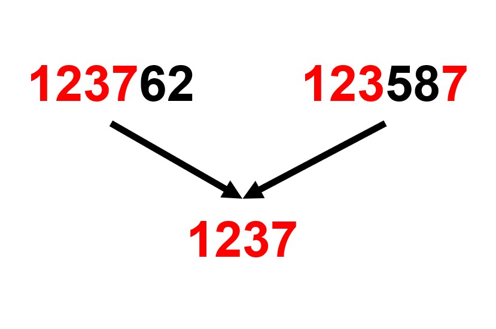

# LCS

## 소개

최장 공통 부분 수열은 주어진 여러 개의 수열 모두의 부분 수열이 되는 수열들 중에 가장 긴 것입니다. 부분 수열은 그 수열의 일부 항을 원래 순서대로 나열해 얻을 수 있는 수열입니다. 이때 꼭 연속하지 않아도 되며, 연속한 경우는 최장 공통 문자열이라고 부릅니다.

사실 최장 공통 부분 수열은 문자를 다룰 수도 있습니다. '공통 부분 수열'과 '공통 문자열'의 차이는 연속해야 하는지의 여부입니다. 따라서 '공통 부분 수열'이 꼭 숫자로만 이루어지지 않을 수도 있습니다. *1243* 은 *ABDC*일 수도 있고, *@^$&*일 수도 있음을 유의하시기 바랍니다.

아래와 같이 짧은 LCS는 매우 간단하므로 눈으로도 쉽게 답을 찾을 수 있습니다.

