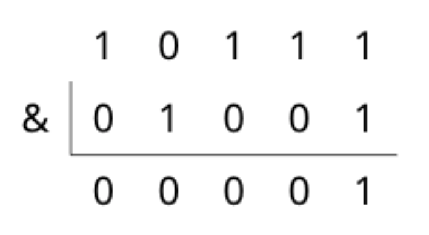

# Bit Operator

## 소개

비트 연산자란, 각 수의 비트에 대한 연산을 진행하는 연산자입니다. 비트 연산자의 종류는 다음과 같습니다.

* 비트 AND(&)
* 비트 OR(|)
* 비트 XOR(^)
* 비트 LSHIFT(<<), RSHIFT(>>)
* 비트 NOT(~)

비트 연산자를 사용하면 좋은 점이 무엇일까요? 가장 큰 장점은 연산 속도가 빨라진다는 점입니다. 비트연산은 일반적인 사칙연산 연산자들보다 연산 속도가 빨라 시간복잡도를 줄이는데 도움을 줄 수 있습니다. 


## BIT AND

비트 AND 연산자는 같은 자리의 Bit를 비교하여 둘다 1이면 그 자리에 1을, 둘 중 하나라도 1이 아니면 0을 계산 결과로 내놓는 연산자입니다. Bit 연산이므로 2진수를 기준으로 연산하며, 일반 사칙연산보다 그 속도가 빠릅니다. 예를 들어 다음 코드와 같은 연산을 할 수 있습니다.

``` c++
printf("%d\n", 23 & 9); //1
printf("%d\n", 22 & 11); //2
printf("%d\n", 31 & 31); //31
```


맨 위의 식을 예로 들어본다면 23은 이진수로 \\(10111_{(2)}\\)이고 9는 이진수로 \\(1001_{(2)}\\)이기 때문에 &연산을 취해준다면



와 같이 됩니다.

그렇다면 논리 AND와의 다른점은 어떻게 될까요? 

다음 코드를 봅시다.

``` c++
if(3 & 2) printf("Bit says true.\n");
if(3 && 2) printf("Logic says true.\n");
```

`3 & 2`을 계산하면 0이 나오기 때문에 첫번째 `printf`는 실행이 되지 않습니다. 그러나 두번째 if문은 0이 아닌 두 값을 논리 AND연산을 하였기 때문에 참이 됩니다. 따라서 두번째 `printf`만 실행됩니다.

정리하자면 논리 AND는 __0이면 false, 그 이외의 값이라면 true로 판단하여 연산을 진행하지만,__ 비트 AND는 **각 비트마다 0, 1로 연산을 진행한다는 점**을 염두에 두어야 합니다. 이는 논리연산과 비트연산의 중요한 차이점이니 꼭 짚고 넘어갑시다.


## BIT OR

비트 OR 연산자는 같은 자리의 Bit를 비교하여 둘다 0이면 그 자리에 0을, 둘 중 하나라도 0이 아니면 1을 계산 결과로 내놓아 하나의 수를 만듭니다. 예를 들어 다음 코드와 같은 연산을 할 수 있습니다.

``` c++
printf("%d\n", 23 | 9); //31
printf("%d", 2 | 1); //3
printf("%d\n", 31 | 31); //31
```


마찬가지로 맨 위의 식을 예로 들어본다면


와 같이 됩니다.

논리 OR는 비슷하게 입력값이 0이면 false, 그 이외에는 전부 true를 기준으로 연산을 진행합니다. 다음 코드를 봅시다.

``` c++
if(1 | 0) printf("Bit is true.\n"); //true

if(1 || 0) printf("Logic is true.\n"); //true
```


## BIT XOR

비트 XOR 연산자는 같은 자리의 Bit를 비교하여 그 비트가 서로 같다면 그 자리에 0을, 다르다면 1을 계산 결과로 내놓아 하나의 수를 만듭니다. ~~제곱을 나타내는 기호가 아닙니다.~~

``` c++
printf("%d\n", 23 ^ 9); //30
printf("%d\n", 2 ^ 1); //3
printf("%d\n", 31 ^ 31); //0
```


가장 위의 식을 또 예로 들어본다면


와 같이 연산이 되는 것을 알 수 있습니다.


## BIT SHIFT

 비트 SHIFT 연산은 위의 연산들과 성격이 약간 다릅니다. 위에 있는 연산들은 교환법칙이 성립했다면, 이 연산은 교환법칙이 성립할 수 없습니다. 이 연산은 첫 번째 숫자를 두 번째 숫자만큼 비트 단위로 왼쪽/오른쪽 방향으로 미는 것입니다.

그럼 정확하게 민다는 것이 무슨 뜻일까요? 다음 코드를 봅시다.

``` c++
printf("%d\n", 20 >> 2); //5

printf("%d\n", -6 >> 2); //-1

printf("%d\n", 12 << 3); //96
```

첫 번째 예를 살펴봅시다. 20은 이진수로 \\(10100_{(2)}\\) 입니다. 이 수를 오른쪽으로 두번 shift하면 5, 즉 \\\(101_{(2)}\\)이 된다는 것을 쉽게 알 수 있습니다.

그러면, RSHIFT 연산후, 가장 왼쪽 비트에 나오는 숫자는 무엇일까요? 다음 예를 살펴봅시다.

-6을 이진수로 표현한다면(부호가 있는 32비트 정수 기준) \\(1111 1111 1111 1111 1111 1111 1111 1010_{(2)}\\)입니다. 만약 shift 후 왼쪽에 0이 채워진다면, 첫번째 연산은 그대로 5이지만, 이 연산은 음수가 양수로 바뀌면서 약 10억정도에 가까운 숫자가 만들어지게 됩니다. 그러나, 실제 계산해보면 이 연산의 결과는 -1이 나옵니다. 즉, __RSHIFT연산 후 왼쪽에 채워지는 비트는 연산 전에 원래 부호 비트로 있었던 비트를 채운다는__ 거죠. (부호 없는 비트의 경우 오른쪽에 0을 채웁니다.)

LSHIFT 연산에 경우는 왼쪽으로 shift하면서 오른쪽에 0을 채웁니다. 여기서 눈여겨 볼 점은, 정수 N을 M번 shift 했을때, 계산 결과가 \\(N \times 2^{M}\\)으로 나온다는 것이죠. 그렇다면 RSHIFT는 어떨까요? 그 연산은 실행시켜보면 \\(N\\)을 \\(2^{M}\\)으로 나눈 몫이 나옵니다. 곧, SHIFT 연산은 __어떤 숫자를 2의 거듭제곱만큼 곱하거나 나눈 결과값을 반환한다고 할 수 있습니다.__


## BIT NOT

비트 NOT연산자는 위의 연산자들과는 달리 단항연산자입니다. 단항연산자란, 하나의 수에 적용되는, 사칙 연산보다는 부호 연산과 더 가깝다고 할 수 있는 연산자 입니다. 이 연산자가 어떤 수 앞에 붙는다면 그 수의 비트를 전부 반대로 바꿔줍니다. 다음 코드를 살펴봅시다.

``` c++
printf("%d", ~10); //-11
```

NOT연산의 결과를 통해 부호가 바뀌어서 당황스러울 수 있지만, 첫번째 비트가 부호를 결정하기 때문에 그 비트까지 바뀌어서 부호가 바뀐 것입니다.

이 NOT연산은 특징이 있습니다. `~N`은 항상 `-N-1`이 됩니다. 이 결과는 비트 반전하여 계산하면 쉽게 알 수 있는데, __이 비트 NOT연산을 한 수를 그 수의 보수라고 합니다.__

