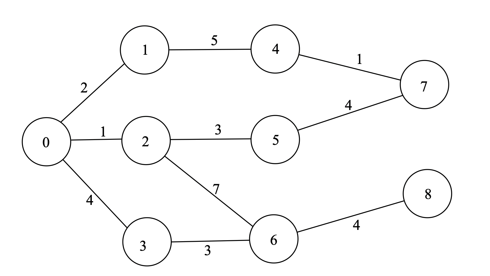

# Dijkstra Algorithm

## 소개

Dijkstra 알고리즘은 그래프의 정점들 사이의 최단경로를 찾기 위한 알고리즘 중 하나입니다.

Dijkstra 알고리즘은 음수 간선이 없는 그래프에서 사용할 수 있으며, 어떠한 정점과 다른 모든 정점들 사이의 최단경로를 \\(O(|E|\log|V|)\\)만에 구할 수 있습니다. 최단 거리 문제에서 매우 자주 쓰이는 알고리즘 중 하나입니다.

## 과정

Dijkstra 알고리즘의 아이디어는 생각보다 간단합니다. 현재까지 밝혀진 최단거리가 가장 작은 정점을 조사하여 이 정점과 연결된 정점들의 최단경로를 업데이트하는 과정을 반복하는 것이죠. 아래와 같은 그래프를 봅시다. 



0번 정점에서 다른 모든 정점까지의 최단경로를 구하려면 어떻게 해야 할까요? 우선 정점 `i`부터 정점 `j`까지의 간선의 길이를 `d[i][j]`라 하고, 최단경로의 배열 `dist[]`, 현재까지 조사한 최단경로의 배열 `cost[]`를 정의합시다. 

다익스트라 알고리즘에서는 먼저, `cost[0]`을 0, `cost[1] ~ cost[|V|-1]`을 \\(\infty\\)로 놓습니다. 그리고 `cost`값이 가장 작은 정점부터 조사하기 시작합니다. 다른 정점들의 `cost`값이 모두 이 정점보다 크고, 그래프에 음수 간선이 없다는 것을 알고 있기 때문에 이 간선의 `cost`값이 최종적인 최단경로의 길이와 같다는 것이 자명합니다. 따라서 이 정점의 `dist`값은 `cost`값과 같다는 것을 알 수 있습니다. 여기서는 `cost[0]`이 제일 작으므로 먼저 0번 정점을 봅시다. 0번 정점과 연결된 다른 정점들(1,2,3) 각각에 대해, 최단경로를 업데이트할 수 있는지 검사해 봅니다. 

기존 `cost[i] (i=1, 2, 3)`값보다 `dist[0]`+`d[0][i]`이 작다면 `cost[i]`를 `dist[0]+d[0][i]`로 업데이트합니다. 원래 `cost`값이 전부 \\(\infty\\)였으므로 각각의 `dist`값은 2, 1, 4로 업데이트됩니다. 

이제 남은 정점 중에서 `dist`값이 가장 작은 2번 정점을 봐야 합니다. 2번 정점에 대해서도 연결되어 있는 각 정점의 최단경로 업데이트를 계속합니다. 나머지 정점들 중에서도 `dist[i]`값이 가장 작은 점을 찾아내 같은 과정을 계속 반복합니다. 이를 총 \\(|V|\\)번 반복하면 결과적으로 0번 정점으로부터 다른 모든 정점까지의 최단경로를 계산할 수 있습니다.

## 코드

다익스트라 알고리즘의 실제 구현 방법을 봅시다. 위의 설명 그대로 단순하게 구현한 프로그램은 \\(O(|E||V|)\\)의 시간에 동작하지만, 우선순위 큐를 이용하면 \\(O(|E|\log |V|)\\)의 시간에 동작하도록 할 수 있습니다. `cost[]`배열을 이용하는 대신 우선순위 큐를 사용해 최솟값을 관리하는 것이죠.
최단거리 업데이트 과정에서 모든 간선은 한 번씩만 사용되므로 우선순위 큐에 각 우선순위 큐에는 최대 총 \\(|E|\\)번의 삽입/삭제 연산이 일어나게 됩니다. 이에 의한 시간 복잡도는 \\(O(|E|\log |E|)\\)이고, \\(|E|\\)는 \\(|V|^2\\)보다 작으므로 이는 \\(O(|E|\log |V|)\\)라고 할 수 있습니다.

아래 코드의 `dijkstra()` 함수는 STL의 `priority_queue` 자료구조를 사용하여 Dijkstra 알고리즘을 구현하는 예시입니다. `pair<int, int>`자료형의 `first`값은 거리, `second`값은 노드 번호입니다.
`pair`자료형에서 크기 비교 기준은 `first`값이므로, 우선순위 큐는 자동적으로 거리에 대한 오름차순으로 정렬되게 됩니다. 이미 방문한 정점 검사는 현재 원소의 `second`값, 즉 거리 값이 `dist[(현재 원소의 first값)]`보다 크거나 같은지를 이용하면 쉽게 가능합니다. 이미 방문한 정점이라면 `dist`값이 최단거리 값으로 업데이트되어 있기 때문에 `dist`값보다 더 작은 거리값은 나올 수 없기 때문이죠.

``` c++
#include<bits/stdc++.h>
#define V 100000 //maximum number of nodes

using namespace std;
typedef pair<int, int> pp;

int dist[V];

vector<pp> d[V]; //first=weight, second=node number
priority_queue<pp, vector<pp>, greater<pp> > cost; //first=distance, second=node number

void dijkstra(int v){
	int i, j;
	pp t;
	for(i=0;i<v;i++) dist[i]=INT_MAX;
	cost.push(pp(0, 0));
	for(i=0;i<v;i++){
		while(cost.top().first>=dist[cost.top().second]) cost.pop(); //delete already visited nodes
		t=cost.top(), cost.pop();
		dist[t.second]=t.first;
		for(j=0;j<d[t.second].size();j++){
			cost.push(pp(dist[t.second]+d[t.second][j].first, d[t.second][j].second));
		}
	}
}
```

## 예시

[거의 최단 경로 문제](https://www.acmicpc.net/problem/5719)를 Dijkstra 알고리즘을 통해 풀 수 있다.

단순한 최단 경로를 계산하려면 다익스트라 알고리즘을 한 번 사용하면 됩니다. 그러나 우리가 찾아야 하는 것은 "거의 최단 경로"이기 때문에, 최단 경로의 간선들을 모두 제거한 후 다시 다익스트라 알고리즘을 사용해야 합니다. 그렇다면 최단 경로의 간선을 제거하는 과정은 어떻게 구현할 수 있을까요? 다익스트라 알고리즘을 약간만 보완하면 됩니다. 각 정점에 대해서 단순히 최단경로의 길이 값만 저장하는 것이 아니라, 그 정점 직전의 정점의 번호도 저장하는 것이죠. 그 후 최단 경로의 간선들을 제거할 때는 간단한 백트래킹을 활용하면 됩니다. 예시 코드에서는 정점 번호를 -1로 바꾸는 방법으로 간선을 제거하였습니다.

한 가지 주의할 점은 최단경로가 하나가 아닐 수 있다는 것입니다. 따라서 모든 최단 경로를 저장하지 않으면 정답을 내지 못할 수도 있으므로 조심하세요.
