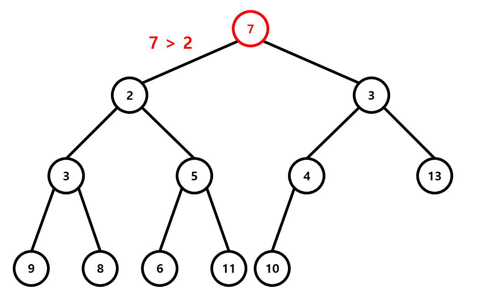
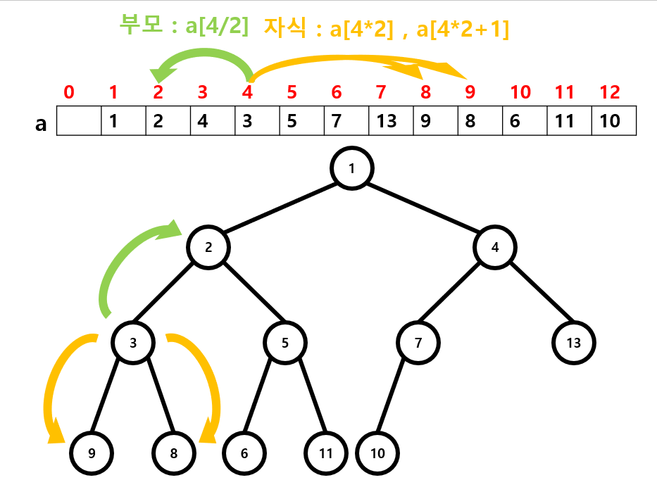

# Heap

## 소개

힙이란 특정한 규칙을 만족하도록 구성된 완전이진트리로써, 최댓값 및 최솟값을 빠르게 찾기 위해 고안되었습니다. 완전이진트리가 무엇인지는 RB tree 단원에서 배웠을 것이라고 생각하고 바로 힙에 대한 설명으로 넘어가겠습니다. 힙은 부모와 자식 사이에 일정한 대소관계 규칙이 있는 트리입니다. 따라서 뿌리노드에는 항상 가장 높은(또는 가장 작은) 우선순위의 노드가 위치하게 됩니다. 부모가 항상 자식보다 크거나 같은 경우는 최대 힙(max heap)이라고 하고 그 반대의 경우는 최소 힙(min heap)이라고 합니다. 이렇게 만들어 놓으면 주어진 값들의 최솟값이나 최댓값을 바로 알 수 있습니다. min heap의 경우 뿌리노드가 최솟값이고, max heap의 경우는 최댓값이겠지요.


위 그림은 전형적인 최소 힙의 모습입니다. 그림을 보면 항상 부모노드가 자식노드보다 작으므로 이것은 최소 힙(min heap) 이라고 할 수 있겠습니다.

## 연산

힙에서는 삽입(push)과 삭제(pop) 연산을 할 수 있습니다. 

### Push

삽입을 할 때는 완전이진트리의 형태가 유지되도록 가장 마지막 위치에 저장을 하고, 부모와 비교를 해 가며 min heap의 경우 부모가 새로 추가된 자식보다 큰 경우 이 둘을 교환하는 식으로 알맞은 자리를 찾아가게 합니다.


위 그림은 아까의 Heap에 3을 삽입(push)한 경우를 나타낸 것입니다. 완전이진트리의 끝에 삽입된 3은 부모인 7보다 작으므로 min heap의 성질을 유지시키기 위해 이 둘을 바꿉니다. 그 뒤 3과 새로운 부모인 4를 비교해 이 둘을 바꿉니다. 이렇게 생긴 새로운 부모인 1은 3보다 작으므로 3의 위치는 현재 자리로 확정이 됩니다. 이 교환 과정에서 걸리는 시간은 최대가 트리의 깊이이고, 따라서 삽입 연산의 시간복잡도는 \\(O(\log n)\\)이 됩니다.

### Pop

삭제를 할 때는 완전이진트리의 뿌리에 있는 값을 pop 한 후 가장 끝에 있는 노드를 루트 노드로 가져온 뒤 두 자식들과 비교해 힙의 성질을 유지시키도록 만듭니다.



위 그림은 아까의 Heap에서 pop연산을 하는 경우를 나타낸 것입니다. 먼저 뿌리노드의 1이 삭제되고 그 자리를 맨 끝에있는 7이 채웁니다. 그 뒤 자식과 비교하였을 때 2가 3,7보다 작으므로 2와 7의 위치를 바꾸고, 새로운 7의 위치에 대해 이것을 반복하여 7이 자식들보다 더 작아질 때까지 이것을 반복합니다. 이렇게 하면 가장 작은 원소를 빼내면서 Heap의 구조를 유지시킬 수 있습니다. 마찬가지로 pop도 시간복잡도가 \\(O(\log n)\\)이 됩니다.

## 구현

힙을 실제로 C++에서 구현할 때는 주로 1차원 배열이 사용됩니다. `a`이라는 배열이 있다고 하고 `a[1]`을 루트 노드로 지정하면 힙은 완전이진트리이기 때문에 `a[n]`을 부모로 하는 자식들은 `a[n*2]`와 `a[n*2+1]`임을 알 수 있습니다. 따라서 어떤 위치 `a[n]`에 대해 자식은 `a[n*2]`와 `a[n*2+1]`, 부모는 `a[n/2]`로 쉽게 위치를 특정할 수 있습니다.



이렇게 배열로 Heap을 구현하는 경우 먼저 부모와 자식 사이에 대소관계규칙이 성립하는지 판단하는 함수를 만들 수 있습니다.

``` c++
bool comp(int parent, int son){
    if (parent <= son)
        return true;
    else
        return false;
}
```

그리고 아래와 같이 push를 구현할 수 있습니다.

``` c++
void update(int ind){
    if (ind == 1 || comp(heap[ind / 2], heap[ind]))
        return;
    swap(heap[ind], heap[ind / 2]);
    return update(ind / 2);
}
void push(int k){
    heap[sizz] = k;
    update(sizz);
    sizz++;
}
```

그리고 pop은

``` c++
void update2(int ind){
    if (ind * 2 > sizz)
        return;
    if (ind * 2 == sizz || comp(heap[ind * 2], heap[ind * 2 + 1])){
        if (comp(heap[ind], heap[ind * 2]))
            return;
        swap(heap[ind], heap[ind * 2]);
        return update2(ind * 2);
    }
    if (comp(heap[ind], heap[ind * 2 + 1]))
        return;
    swap(heap[ind], heap[ind * 2 + 1]);
    return update2(ind * 2 + 1);
}
int pop(){
    int re = heap[1];
    if (sizz == 1)
        return 0;
    heap[1] = heap[sizz-1];
    sizz--;
    update2(1);
    return re;
}
```

이렇게 구현이 가능합니다.

## 예제

>[문제](https://www.acmicpc.net/problem/11286)
>
>절댓값 힙은 다음과 같은 연산을 지원하는 자료구조이다.
>
>1. 배열에 정수 x (x ≠ 0)를 넣는다.
>2. 배열에서 절댓값이 가장 작은 값을 출력하고, 그 값을 배열에서 제거한다. 절댓값이 가장 작은 값이 여러개일 때는, 가장 작은 수를 출력하고, 그 값을 배열에서 제거한다.
>3. 프로그램은 처음에 비어있는 배열에서 시작하게 된다.
>
>----
>
>입력
>
>첫째 줄에 연산의 개수 N(1≤N≤100,000)이 주어진다. 다음 N개의 줄에는 연산에 대한 정보를 나타내는 정수 x가 주어진다. 만약 x가 0이 아니라면 배열에 x라는 값을 넣는(추가하는) 연산이고, x가 0이라면 배열에서 절댓값이 가장 작은 값을 출력하고 그 값을 배열에서 제거하는 경우이다. 입력되는 정수는 -231보다 크고, 231보다 작다.
>
>----
>
>출력
>
>입력에서 0이 주어진 회수만큼 답을 출력한다. 만약 배열이 비어 있는 경우인데 절댓값이 가장 작은 값을 출력하라고 한 경우에는 0을 출력하면 된다.


이 문제는 매우 간단한 Heap 예제입니다. 이 문제는 아까 구현한 코드에서 comp 함수의 비교 기준을 절댓값으로 살짝 바꿔주시기만 하면 됩니다.

## Priority Queue

하지만 힙을 매번마다 구현하기는 어렵습니다. 그래서 실전에서 문제를 풀 때는 stl에 있는 `priority_queue`를 사용하는 것을 추천합니다. `priority_queue`는 `<queue>` 헤더에 있습니다. `priority_queue`는
`priority_queue <자료형> mypq`
로 선언하며, 사용할 수 있는 함수는 힙에 `k`라는 값을 push하는  `mypq.push(k)`, pop을 진행하는 `mypq.pop(),` 힙이 비어있으면 true를 반환하는 `mypq.empty()`, 루트노드에 있는 원소를 반환하는 `mypq.top()` 등이 있습니다.

