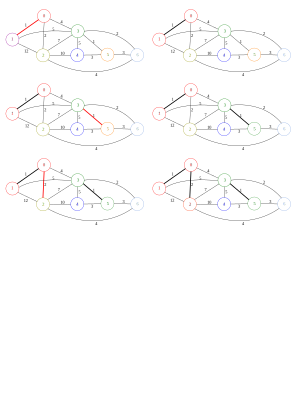

# Kruskal's Algorithm

## 소개

크루스칼의 알고리즘은 가중치가 작은 간선부터 최소 스패닝 트리에 추가해가며 그래프의 최소 스패닝 트리를 구하는 방법으로, [[ Disjoint Set ]]을 사용합니다.

## 과정

크루스칼의 알고리즘은 최소 스패닝 트리에는 가중치가 작은 간선이 들어가야 한다는 아이디어를 바탕으로 MST를 구합니다.

알고리즘 자체도 아이디어만큼 간단합니다. 모든 간선들을 가중치를 기준으로 정렬한 다음, 가중치가 가장 작은 간선부터 조사합니다. 만약 그 간선이 잇는 두 정점이 이미 연결되어 있다면 다음 간선으로 넘어가고, 연결되어 있지 않다면 그 간선을 최소 스패닝 트리에 추가합니다. 아래 그림들은 주어진 그래프에 대한 크루스칼의 알고리즘의 동작 과정을 보여줍니다.


아래 그림에서 색이 같은 정점은 이미 연결된 정점을, 색이 다른 정점은 아직 연결되지 않은 정점을 의미합니다. 붉은색 간선은 현재 보고 있는 간선을 뜻하며 진한 간선은 이미 최소 스패닝 트리에 추가되었음을 나타냅니다.



정점들이 연결되어 있는지 확인하거나 연결하는 연산에 [[ Disjoint Set ]]을 사용하면, 연산당 시간 복잡도는 \\(O(\alpha (|V|))\\)이므로 트리를 만드는 부분은 거의 \\(O(|E|)\\)의 시간에 작동합니다. 따라서 전체 시간 복잡도는 정렬에 걸리는 시간인 \\(O(|E|\log |E|)\\)가 됩니다. \\(|E|<|V|^2\\)이므로 이는 \\(O(|E|\log |V|)\\)로도 나타낼 수 있습니다.

## 코드

``` c++
#include<bits/stdc++.h>
#define V 100000 //maximum number of nodes
#define E 100000 //maximum number of edges

using namespace std;

int parent[V];

struct Edge{
	int start, end, value;
	bool operator <(const Edge &r) const{
		return value<r.value;
	}
}edge[E];

int find(int x){
	if(parent[x]==x) return x;
	return parent[x]=find(parent[x]);
}

bool uni(Edge x){
	int p=find(x.start), q=find(x.end);
	if(p==q) return 0;
	parent[p]=q;
	return 1;
}

void initSet(int e){
	for(int i=0;i<e;i++) parent[i]=i;
}

int kruskal(int e){
	int ret=0;
	initSet(e);
	sort(edge, edge+e);
	for(int i=0;i<e;i++) if(uni(edge[i])) ret+=edge[i].value;
	return ret;
}
```

