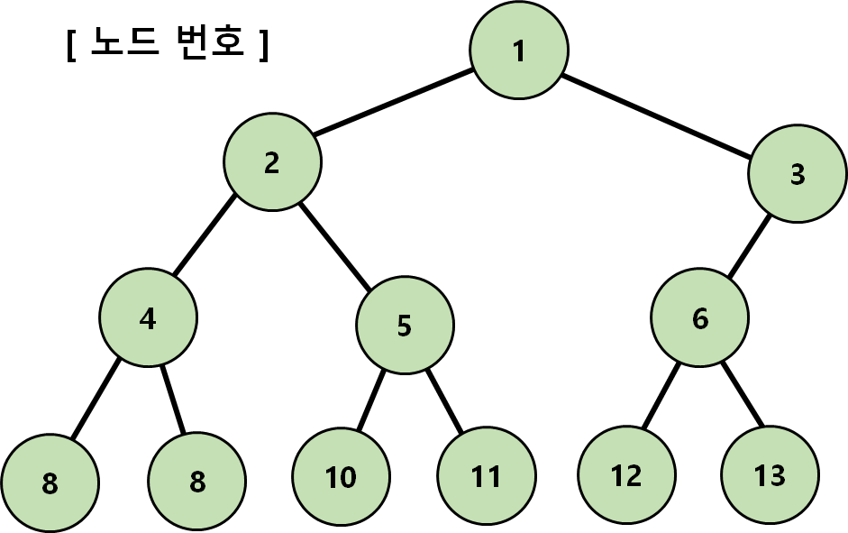
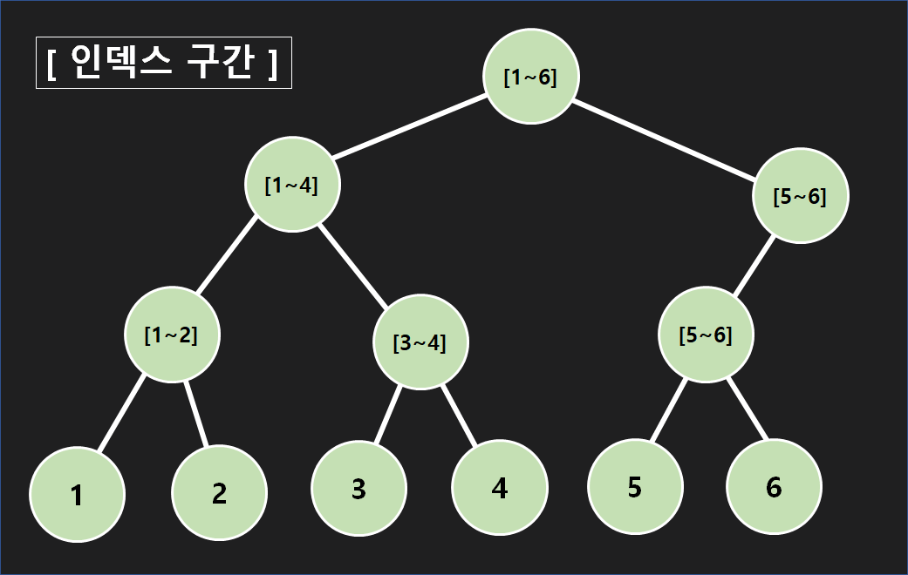
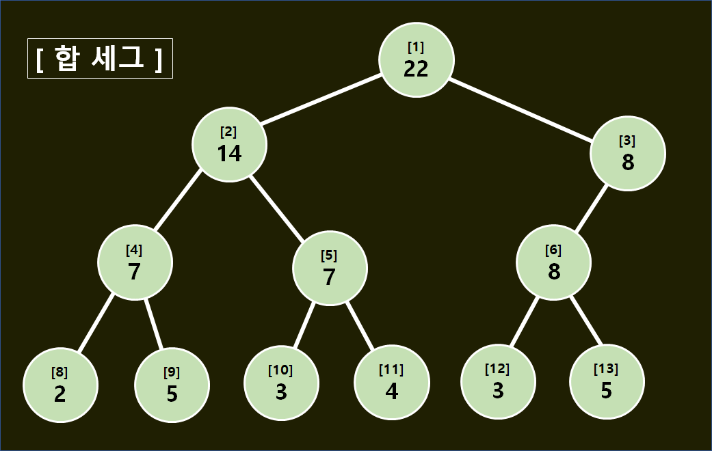
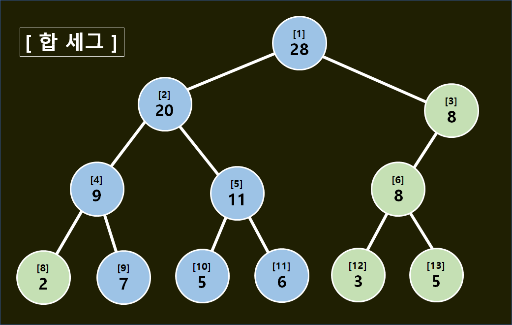
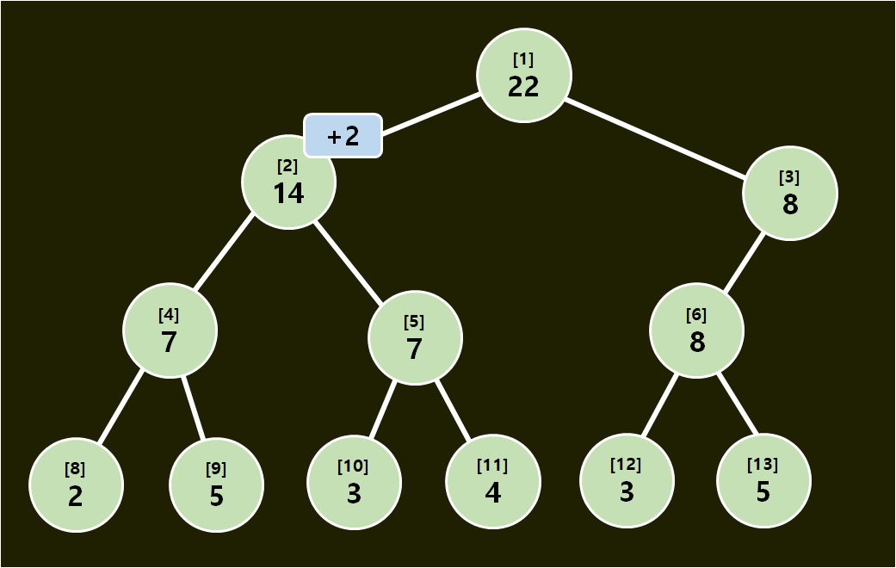
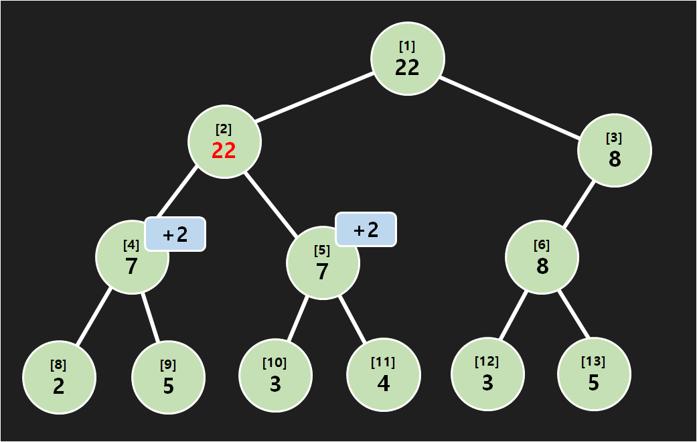
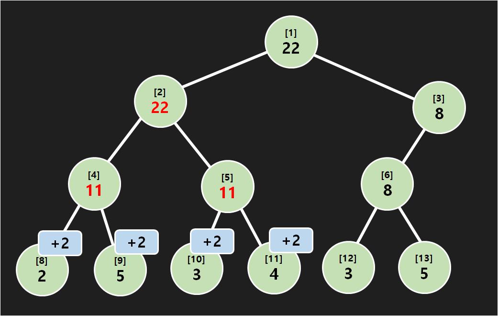

# Lazy Propagation

## 들어가기에 앞서...

Lazy Propagation은 Segment Tree라는 자료구조 위에서 쓰이는 알고리즘입니다. 따라서 [[ Segment Tree ]]을 충분히 이해한 다음에, Lazy Propagation을 공부하는 것을 추천합니다.

## 소개

Segment Tree를 사용하면 구간에 대한 쿼리를 빠른 시간복잡도로 처리할 수 있습니다. 구체적으로, 합 세그먼트 트리가 어떤 쿼리 쌍을 처리할수 있는지 생각해 봅시다.

(한 원소 특정한 수를 더하는 쿼리, 구간의 합을 구하는 쿼리)

(연속한 구간에 특정한 수를 더하는 쿼리, 한 원소의 값을 구하는 쿼리)

중요한 점은, 값을 더하는 쿼리와 합을 구하는 쿼리 둘 중 하나는 반드시 '한 원소'로 범위가 제한된다는 점입니다. 즉, "연속한 구간에 특정 수를 더하고, 연속한 구간의 합을 구하는 쿼리" 는 Segment Tree만 사용해서는 처리할 수 없습니다. 왜 안되는지는 직접 생각해 보는것을 추천합니다. 여기서 Lazy Propagation이 등장합니다.

Segment Tree에서 Lazy Propagation을 사용한다면 구간 갱신 쿼리, 구간 질의 쿼리를 모두 해결할 수 있습니다. 물론 시간복잡도는 그대로입니다. ( 쿼리당 \\(O(\log N)\\) ). 어떻게 해결할까요? 이름에서 알 수 있듯이, 바로 "게으른 전파"를 통해서입니다.

## 왜 Lazy Propagation이 필요한가?

설명에 들어가기에 앞서, 헷갈리지 않게 용어들을 먼저 정리합시다. 세그먼트 트리에는 노드들의 이름인 [노드 번호] 와, 각각의 노드들이 관리하는 [인덱스 구간]이 있습니다.

[노드 번호] 는, 어디까지나 Segment Tree의 1-based 구현 방식에서 자동으로 붙여지는 번호를 기준으로 하고 있습니다.

이제 정의는 끝났으니 왜 Lazy Propagation이 필요한지 알아봅시다. 이해를 돕기 위해, 특정 구간에 \\(\pm x \\)를 하거나, 특정 구간의 총 합을 구하는 Segment Tree를 생각해 봅시다.

위 모습은 구간 [1,6] 의 원소가 각각 2,5,3,4,3,5 인 합 세그먼트 트리입니다. 한번 구간 [2,4]에 2를 더해봅시다. 바뀐 모습은 아래와 같습니다.

합 세그를 유지하기 위해 1,2,4,5,9,10,11번 노드의 값이 변경되었습니다. 만약에 전체 구간의 값을 변경한다면 세그의 모든 노드의 값을 바꿔야 할 것입니다. 그렇다면 당연히 쿼리당 logn 의 시간을 유지할 수 없습니다. 하지만, Lazy Propagation을 사용한다면 구간에 대한 합, 구간 업데이트 쿼리를 쿼리당 logn 의 시간에 해결할 수 있습니다. 서론이 길었군요, 지금부터 Lazy Propagation이 어떻게 작동하는지 알아보도록 합시다.

## Lazy Propagation의 작동원리

구간 전체를 업데이트 한다면, 세그의 모든 노드가 값이 갱신될 것입니다. '한번에' 이 값을 변경시킨다고 생각한다면, 당연히 이 작업을 logn 에 수행하는것은 불가능해 보입니다. 하지만, 굳이 한번에 값을 갱신할 필요는 없습니다. Lazy Propagation은 게으르게 값을 갱신함으로써 쿼리당 O(logn)시간을 가능하게 합니다.

[1,4] 구간에 +2을 해봅시다. 그러면 Lazy Propagation에서는 [1,4]구간을 관리하는 2번 노드에 +2 을 할 예정이라고만 저장합니다. 그 아래 노드인 4,5 번 노드까지는 내려가지 않습니다. 나중에 쿼리를 처리하면서 더 깊이 내려갈 일이 생기면 그제서야 변화를 적용하고, 자식으로 전파시킵니다. 예제를 보면서 이해해 봅시다.

구간 [1,4] 에 +2를 했기 때문에, 노드 2에 +2라는 값이 붙었습니다. 이 값을 lazy라고 합시다. 잘 보면 세그의 값은 아무것도 바뀌지 않았습니다. 

이런 상황에서 구간 [3,4]의 합을 구할 수 있을까요? 언뜻 보면 실제 답은 11 이지만, 세그는 그대로이기 때문에 잘못된 값인 7을 구할 것 같습니다. Lazy Propagation의 작동을 따라가 봅시다. 시작은 당연히 1번 노드입니다. 그리고 2, 3번 노드를 호출하지만 3번 노드는 관련이 없으니 바로 return합니다. 2번노드를 보니 lazy가 있으니 갱신을 해줍시다. 먼저 노드 2의 값에다가 lazy * 구간의 길이 = 2 * 4 = 8을 더해줍니다. 그리곤 lazy를 자식으로 전파시킵니다.

이제 2번 노드에서 할 일은 모두 끝났으니 4,5 번 노드를 호출합니다. 4번 노드는 구간 [3,4]를 벗어나긴 하지만, return하기 전에 lazy처리를 먼저 해줍시다. 위와 똑같이 노드 4의 값에다가 + 4를 해주고, 자식에게 lazy를 전파시킵니다. 이후엔 바로 return 합니다. 

이제 5번 노드를 봅시다. lazy가 있으니 lazy처리부터 합시다. 5번 노드에다가 +4를 해주고, 자식에게 lazy를 전파시킵니다.
5번 노드의 범위는 [3,4] 이고, 구하는 범위 안쪽에 있으니 11을 return합니다.

제대로 된 값인 11을 구하는 모습을 볼 수 있습니다. 이런 게으른 전파가 가능한 이유는 Top-Down 방식 덕분입니다. 특정 노드를 업데이트 하기 위해서는 모든 부모 노드를 거쳐서 내려오기 때문에 그동안의 lazy가 모두 전파되면서 오류 없이 Segment Tree를 관리할 수 있는 것입니다. 이 아이디어는 갱신 쿼리, 합 쿼리 모두에 적용됩니다. 구체적인 구현 방식은 조금조금씩 다르겠지만, 몇가지 유의해야 할 사항이 있습니다.