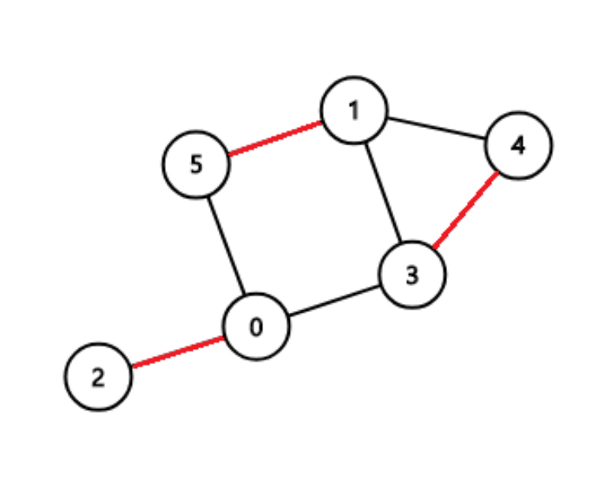

# Matching on Bipartite
## 소개
### 최대 매칭
그래프에서 매칭이란, 각 정점이 단 하나의 간선으로 다른 정점과 이어져 있는 부분 그래프에서 연결들의 집합이다. 이 때, 최대 매칭 문제란 매칭 중 가장 많은 연결을 포함하는 매칭을 찾거나 매칭의 크기를 찾는 문제다.

<?xml version="1.0" encoding="UTF-8"?> 

일반적인 그래프에서 매칭을 찾는 알고리즘은 복잡하여 Problem Solving에서는 다루지 않지만, 특수한 상황에서 구현하기 쉽고 빠른 알고리즘을 쓰는 문제들이 제시되기도 한다. 그 중 자주 나오는 문제가 이분 매칭이다.
### 이분 매칭
이분 매칭(Bipartite Matching)이란, 이분 그래프[^1]에서의 최대 매칭 문제를 말한다. 

<?xml version="1.0" encoding="UTF-8"?> 
**이분 그래프**


이분 매칭은 두 집합 간의 원소를 대응시키는 문제로 생각할 수도 있다. 각 사람이 할 수 있는 일이 정해져 있을 때, 가장 많은 일을 처리하는 방법을 찾는 경우 **사람**과 **일** 사이 이분 그래프를 만든 다음 최대 이분 매칭의 수를 찾는 문제를 풀면 쉽게 해결할 수 있다. 또, 이분 그래프는 최대 매칭과 최소 정점 덮개(vectex cover)가 같다는 성질도 가지고 있다.

<?xml version="1.0" encoding="UTF-8"?> 
**이분 매칭**

이분 매칭은 주로 모든 간선의 용량을 1로 하는 [[ Network Flow ]] 알고리즘을 수정하여 해결한다. [[ Edmonds–Karp ]] 알고리즘을 이분 그래프에서 사용하면 [[ DFS ]]를 사용하여 이분 매칭에서 보다 쉽게 증가 경로를 찾을 수 있고, [[ Dinic ]] 알고리즘을 이분 매칭에 맞게 바꾼 [[ Hopcroft-Karp|Matching in Bipartite/#s-2-2 ]] 알고리즘을 사용하여 이분 매칭을 찾을 수도 있다. 

이분 매칭에서는 모든 간선의 용량이 0 또는 1이므로 시간복잡도 역시 일반적인 그래프에서 [[ Network Flow ]] 알고리즘을 사용하는 경우보다 개선된다.

## Code
### DFS을 사용한 방법
DFS를 사용하는 경우 그래프에서 첫 그룹의 점에서 모두 매칭을 시도해볼 수 있다. 
``` c++
bool matching(int here){
	if(visited[here])	return false;
	vistied[here] = true;
	for(int there : adj[here]){
		if(matched[there]==-1){ 
			// 매칭이 되어 있지 않는 노드와 연결된 경우
			matched[there] = here;
			return true; 
		}else if(matching(matched[there])){
			// there가 이미 매칭되어 있지만
			// there와 매칭되어 있는 matched[there]이
			// 다른 노드와 매칭 가능한 경우
			matched[there] = here;
			return true;
		}
	}
	return false;
}

int match(){
	itn cnt = 0;
	fill(matched, matched+VB, -1);
	for(int here=0; here<VA; here++){
		fill(visited, visited+VA, false);
		if(matching(here))	cnt++;
	}
}
```
`matching` 함수는 정점을 최대 한 번만 방문하고, 각 정점에서 간선들을 최대 한 번만 검사하기 때문에 이 함수의 시간복잡도는 \\(O(|E|)\\)가 된다. 또한, `match` 함수에서 모든 정점에 대해 매칭을 시도해 보기 때문에 총 시간복잡도는 \\(O(|V||E|)\\)가 된다.

### Hopcroft-Karp Algorithm
호프크로프트-카프 알고리즘은 증가 경로라는 그래프 상의 경로를 찾아 매칭을 한다. **증가 경로**란 경로 상의 간선이 매칭에 속하는 여부가 `false - true - false - true - false -... - false`등으로 번갈아 나오며 경로의 양 끝 점이 매칭되지 않은 경로를 말한다. 이 증가 경로에 속한 모든 간선을 반전시켜주면[^2] 매칭이 하나 늘어나는 결과를 얻을 수 있다. 또, 이러한 증가 경로가 없는 경우 더 이상 매칭을 할 수 없기 때문에, 증가 경로가 더 이상 없을 때까지 증가 경로를 찾아 매칭을 1 늘려주는 방법으로 이분 매칭을 구할 수 있다. 

이 알고리즘에서 증가 경로를 찾기 위해 [[ Network Flow ]] 알고리즘인 [[ Dinic ]] 알고리즘의 아이디어를 사용해 각 정점에 레벨을 매긴다. 이후 위의 [[ DFS ]]를 이용한 방식에서 레벨이 증가하는 방향의 간선만 사용할 수 있도록 조건을 추가해주면 된다.

모든 정점에 대한 증가 경로를 찾아 매칭을 바꾸는 것의 시간복잡도는 \\(O(|E|)\\)이며, 증가 경로를 모든 정점에 대해 찾는 것을 최대 \\(O(\sqrt(|V|))\\)번만 반복한다는 것이 증명되어 있기 때문에 총 시간복잡도는 \\(O(\sqrt{|V|}|E|)\\)가 된다.

``` c++
void level_check(){
	fill(level, level+VA, -1);
	queue<int> Q;
	for(int i=0; i<VA; i++){
		if(matched_a[i] == -1){
			level[i] = 0;
			Q.push(i);
		}
	}
	while(!Q.empty()){
		int here = Q.front();
		Q.pop();
		for(int there : adj[here]){
			if(matched_b[there]] != -1 && level[matched_b[there]]==-1){
				level[matched_b[there]] = level[here] + 1;
				Q.push(matched_b[there]);
			}
		}
	}
}

bool matching(int here){
	for(int there : adj[here]){
		if(matched_b[there]==-1){
			matched_a[here] = there;
			matched_b[there] = here;
			return true;
		}
		else if(level[matched_b[there]] == level[here] + 1 && matching(matched_b[there]){
		matched_a[here] = there;
		matched_b[there] = here;
		return true;
	}
	return false;
}
int match(){
	int matched = 0, cnt = 1;
	fill(matched_a, matched_a+VA, -1);
	fill(matched_b, matched_b+VB, -1);
	while(cnt>0){
		level_check();
		cnt = 0;
		for(int here=0; here<VA; here++){
			if(matched_a[here]==-1 && matching(here)){
				cnt++;
			}
		}
		matched += cnt;
	}
	return matched;
}
```


---
[^1]: 정점이 두 그룹으로 나뉘어져 같은 그룹 사이 간선이 없는 그래프

[^2]: 매칭에 속한 간선은 매칭에서 제외하고, 아직 매칭에 속하지 않은 간선을 매칭에 추가한다.
