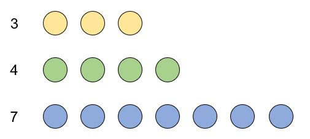

# Nim Game

## 알고리즘에서의 게임

이 챕터에서는 필승 전략 게임의 승패를 판별하는 알고리즘을 다룹니다. 조약돌 게임과 Nim 게임처럼 간단한 게임에서 시작해, 그룬디 수를 이용하여 보다 일반적인 게임에 대응하는 알고리즘을 작성하는 방법까지를 설명할 것입니다.

수학에서 이야기하는 게임은 대부분 다음 조건들을 만족합니다.

* 순차적 게임: 참가자는 다음 참가자가 행동을 정하기 전에 먼저 행동합니다.
* 완전 정보 게임: 모든 참가자는 게임을 완벽하게 이해하고 있고, 게임의 진행 상황도 알 수 있기 때문에 항상 최적의 선택을 합니다. 
* 동일한 상황에 대해 가능한 선택은 참가자에 관계없이 동일합니다.

  앞으로 설명할 조약돌 게임과 Nim 게임 등이 이런 조건을 만족시키는 게임입니다. 반면 체스처럼 플레이어마다 옮길 수 있는 기물이 구분되어 있거나, 포커처럼 확률이 작용하는 게임은 이런 조건을 만족하지 않는 게임입니다.


## 조약돌 게임

조약돌 게임은 `N`개의 조약돌을 한 번에 허용된 개수만큼 가져오다가, 더 이상 가져올 조약돌이 없는 사람이 지는 게임입니다. 수학에서는 보통 두 사람이 번갈아서 하는 경우를 다루며, 이 경우 선공이 반드시 이기거나 후공이 반드시 이기게 됩니다.

`N=31`이고, 한 번에 1개, 2개 또는 3개의 돌을 가져올 수 있는 경우를 생각해 봅시다. 이 경우 선공에게 필승 전략이 있습니다. 처음에 3개를 가져오고, 다음 차례부터는  "\\(4-\mbox{\ (바로 전에 후공이 가져간 개수)}\\)"만큼을 가져가면 됩니다. 이렇게 생각하면, `N`이 4의 배수일 때만 후공이 이길 수 있다는 것도 알 수 있습니다. 가져올 수 있는 돌의 개수가 연속된 자연수일 때 이런 식으로 전체 돌의 개수의 나머지를 유지시키는 전략은 꽤 유명합니다.


그렇다면 가져올 수 있는 돌의 개수가 복잡하면 어떨까요? 사실 조약돌 게임에는 항상  필승전략이 존재합니다. 다만 위처럼 간단하게 정리할 수는 없습니다. 대신 간단한 알고리즘으로, 남은 돌의 개수에 따라 선공이 반드시 이길 수 있는지, 아니면 반드시 지는지를 판단할 수 있습니다.

``` c++
#include <iostream>
using namespace std;

int arg[3] = {1,2,5};

char f(int N) {
    if(N==0) return 'L';

    char ret = 'L';

    for(int i:arg) {
        if(N-i < 0)	continue;
        if(f(N-i) == 'L')	ret = 'W';
    }
    return ret;
}
```

위 코드는 한 번에 가져갈 수 있는 조약돌이 1, 2 또는 5개일 때 처음 조약돌의 개수에 따라 선공의 승패를 판단해 주는 함수입니다. 다르게 말하면, 내 차례가 시작될 때 조약돌의 개수에 따라 나의 승패를 알 수 있습니다.

L은 무슨 선택을 해도 선공이 지는 상황을, W는 선공이 반드시 이길 수 있는 상황을 의미합니다. 만약 내가 어떤 선택을 통해 상대방에게 L 상황을 만들어줄 수 있다면, 나는 반드시 이길 수 있는 W 상황에 있습니다. 반대로, 내가 할 수 있는 모든 선택이 상대방에게 W 상황을 만들어준다면 나는 무조건 지는 L 상황에 있습니다.

## Nim Game

Nim 게임은 매우 유명한 수학적 게임으로, 조약돌 게임을 확장한 것으로 볼 수도 있습니다. 조약돌이 `K`개의 줄을 이루고 있고, 각각의 줄에는 \\(n_{1}, n_{2}, ..., n_{K}\\)개의 조약돌이 있습니다. 참가자는 한 번에 한 줄에서만 조약돌을 가져올 수 있고, 한 번에 가져올 수 있는 개수에는 제한이 없습니다(물론 아예 안 가져오는 것은 불가능합니다). 돌을 가져올 수 없는 사람이 패배합니다.



 얼핏 보면 조약돌 게임에 비해 많이 복잡해 보입니다. 그러나 Nim 게임에서 선공의 승패를 판단하는 알고리즘은 너무나도 간단합니다.

``` c++
#include <iostream>
using namespace std;
int K;
int n[1000];

int main() {
    scanf("%d",&K);
    for(int i=0; i<K; i++)	scanf("%d",&n[i]);
        
    int ret = n[0];
    for(int i=1; i<K; i++)	n[0] ^= n[i];
    
    if(ret==0)	printf("L");
    else	printf("W");
    
    return 0;
}
```

앞에서와 같은 W,L 기호를 사용했습니다. \\(n_{1}, n_{2}, ..., n_{K}\\)끼리 xor 연산을 한 뒤, 결과값이 0이면 L 상황이고 그 외에는 모두 W 상황입니다. 

이렇게 단순한 방법이 왜 성립할까요? Nim 게임과 xor 연산 사이의 관계를 이해하기 위해, `K`가 작을 때부터 살펴봅시다. 

먼저 `K=1`일 때는, 당연히 선공의 승리입니다. 조약돌을 모두 가져가면 이깁니다. `K=2`일 때는 어떨까요? 이때는 \\(n_{1}=n_{2}\\)일 경우 후공이, 아닐 경우 선공이 반드시 이깁니다. \\(n{1}=n{2}\\)에서 선공이 먼저 돌을 가져가면, 후공은 다른 줄에서 선공과 같은 수의 돌을 가져가는 것이 필승전략입니다. \\(n_{1}\neq n_{2}\\) 이면, 선공은 \\(n{1}=n{2}\\)상황을 만들어 후공에게 넘겨서 이길 수 있습니다.
`K=1`, `K=2`일 때의 상황을 위의 xor 알고리즘으로 설명할 수 있음을 간단히 알 수 있습니다.  

## 변형된 Nim 게임

PS 문제에서는 때로 Nim 게임을 다양하게 변형한 문제를 제시합니다.

## 여담

그룬디 수를 이용해 승패를 판정하는 원리와 관련된 이론으로 [스프라그-그룬디 정리](https://en.wikipedia.org/wiki/Sprague-Grundy_theorem#Proof)가 있습니다. 조합적 게임 이론에 관심이 있거나, 이 정리의 정확한 증명을 알고 싶은 사람은 추가로 참고해 보면 좋을 것입니다.
