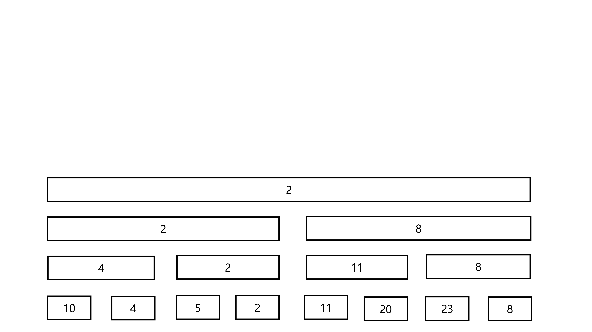

# Segment Tree

## 소개

Segment Tree는 STL에서 지원하지 않는 자료구조이지만 아주 강력한 자료구조중 하나입니다. Segment Tree는 일반적으로 \\(O(\log N)\\)시간에 값의 변경과 값에 대한 쿼리를 수행할 수 있고, 그 활용성 또한 아주 다양해 구간 합 쿼리, 구간 최솟값/최댓값 쿼리등을 수행할 수 있습니다.

Segment Tree의 유래를 찾아보자면 버킷에서 찾아볼 수 있다고 할 수 있습니다. 다음 그림은 원소 2개당 하나의 버킷을 만들어 최솟값을 저장한 모습입니다.


RMQ쿼리를 처리할 때, 그림과 같이 \\(\lceil N/2 \rceil\\) 개의 버킷을 생각해봅시다. 그리고 이 버킷들은 두 원소중 작은 원소의 값을 가지고 있습니다.
그렇다면 어떤 구간의 RMQ쿼리를 처리할 때에는, 봐야 하는 값이 반으로 줄어들게 됩니다. 그리고 값을 갱신하면 자기 자신과, 자신을 포함하는 버킷을 갱신해주면 되겠죠. 

이것을 더 빠르게 하고 싶다면 버킷의 버킷을 만들 수 있습니다. 이런 방법을 사용한다면 봐야 하는 값의 개수가 더욱 줄어들게 되겠죠. 하지만 이런 방법으로는 시간 복잡도에는 영향이 없습니다. 

하지만 이 과정을 계속 반복한다면 봐야 하는 값의 개수가 크게 줄어들 것입니다. 이런 아이디어의 연장이 Segment Tree라고 할 수 있습니다. Segment Tree는 저 과정을 계속 반복해 그림과 같이 한 원소는 약 \\(\log N\\) 개의 노드의 부분에 속하게 됩니다.



또한 어떤 구간을 선택했을 때, 봐야 하는 노드의 개수 또한 \\(O(\log N)\\) 개가 되어 쿼리를 \\(O(\log N)\\) 안에 처리할 수 있게 됩니다. 이것은 자명한 것이, 한 높이에 3가지 이상의 노드를 봐야 한다고 하면 그 3가지중 2가지를 합쳐서 위의 노드를 하나 보는 것으로 대신할 수 있기 때문에 모순이 되어 한 높이에서 최대 볼 수 있는 노드의 개수는 2개가 되기 때문입니다. 

## Code
### Top-Down 
위에서부터 아래 세그먼트로 내려가면서 구간 합을 저장하는 Segment Tree를 구조체로 구현한 코드는 다음과 같다.
``` c++
struct SEG{
    struct NODE{
        int l, r;
        int sum;
    };
    int SZ;
    vector<NODE> seg;
    void add(){
        seg.push_back({-1, -1, 0});
    }
    void Init(int N){
        SZ = N;
        add();
        init(0, 1, SZ);
    }
    void init(int idx, int s, int e){
        if(s==e)    return;
        seg[idx].l = seg.size(); add();
        seg[idx].r = seg.size(); add();
        init(seg[idx].l, s, (s+e)/2);
        init(seg[idx].r, (s+e)/2+1, e);
    }
    void Update(int x, int y){
        update(0, 1, SZ, x, y);
    }
    void update(int idx, int s, int e, int x, int y){
        seg[idx].sum+=y;
        if(s==e){
            return;
        }
        if(x<=(s+e)/2){
            update(seg[idx].l, s, (s+e)/2, x, y);
        }else{
            update(seg[idx].r, (s+e)/2+1, e, x, y);
        }
    }
    int Sum(int x, int y){
        return sum(0, 1, SZ, x, y);
    }
    int sum(int idx, int s, int e, int x, int y){
        if(x<=s && e<=y){
            return seg[idx].sum;
        }else if(x>e || y<s){
            return 0;
        }
        return sum(seg[idx].l, s, (s+e)/2, x, y) + sum(seg[idx].r, (s+e)/2+1, e, x, y);
    }
} Seg;
```

### Bottom-Up
아래에서부터 윗 구간으로 올라가면서 구간 합을 저장하는 Segment Tree를 구현한 코드는 다음과 같다.
``` c++
int seg[MAX_N*2];
int two = 1;

void Init(int N){
    while(two<N)   two*=2;
}

void Update(int x, int y){
    while(x>0){
        seg[x] += y;
        x/=2;
    }
}

int Sum(int x, int y){
    int sum = 0;
    while(x<=y){
        if(x==y){
            sum += seg[x];
            break;
        }
        if(x%2==1){
            sum+=seg[x]; x++;
        }
        if(y%2==0){
            sum+=seg[y]; y--;
        }
        x/=2;
        y/=2;
    }
    return sum;
}
```

### 여담
Bottom-Up으로 Segment Tree를 구현한 코드가 ~~이해하기 쉽고~~ 짧아 보일 수 있지만 [[ Lazy Propagation ]] 같은 방법들을 추가하기 위해서는 Top-Down 방식의 코드를 사용하는 것이 좋다.

## 예시

Segment Tree를 사용하여 [아주 기본적인 부분 합 쿼리 문제](https://www.acmicpc.net/problem/2042)를 처리해보자. 

간단한 구간 합 문제이므로 Segment Tree를 이용해 해결할 수 있습니다.

Segment Tree를 구현할 때, 다양한 방법이 있는데, 재귀함수를 이용하는 방법은 다음과 같다.

``` c++
#include <bits/stdc++.h>

using namespace std;
typedef long long int ll;

ll tree[4400000]; //it is safe to have size*4
ll arr[1100000];
int N,M,K;
void init(int s,int e,int node){
    if(s==e) tree[node]=arr[s]; //leaf node
    else{
        int m=(s+e)>>1;
        init(s,m,node*2);
        init(m+1,e,node*2+1); //recursive
        tree[node]=tree[node*2]+tree[node*2+1];
    }
}
ll range(int s,int e,int node,int l,int r){//l~r
    if(e<l||r<s) return 0;//not in range
    if(l<=s&&e<=r) return tree[node]; // node range inside l~r
    int m=(s+e)>>1;
    return range(s,m,node*2,l,r)+range(m+1,e,node*2+1,l,r); //calls its leaf
}
void update(int s,int e,int node,int pos,int val){
    if(pos<s||e<pos) return ;
    if(s==e){
        tree[node]=val;
        return ;
    }
    int m=(s+e)>>1;
    update(s,m,node*2,pos,val);
    update(m+1,e,node*2+1,pos,val);
    tree[node]=tree[node*2]+tree[node*2+1];//update its value
}


int main(){
    scanf("%d %d %d",&N,&M,&K);
    for(int i=1;i<=N;i++){
        scanf("%lld",&arr[i]);
    }
    init(1,N,1);
    for(int i=0;i<M+K;i++){
        int a,b,c;
        scanf("%d %d %d",&a,&b,&c);
        if(a==1){
            update(1,N,1,b,c);
        }
        else{
            printf("%lld\n",range(1,N,1,b,c));
        }
    }
    return 0;
}
```

tree의 크기는 그 트리가 담당하는 구간의 4배 정도로 하면 안전합니다.
`s`,`e`는 그 트리가 담당하는 구간이고 `node`는 그 트리의 번호입니다. tree의 왼쪽 자식을 나타낼 때에는 (원래 번호)*2를 해주고, 오른쪽 자식을 나타낼 때에는 (원래 번호)*2+1을 해 주어 노드 번호를 변화시킵니다. `update`나 `range`의 특징은 범위에 자신이 해당되지 않거나 완벽히 해당되면 바로 `return `한다는 것입니다. 이 특징 때문에 쿼리당 시간 복잡도는 \\(O(\log N)\\)입니다.


## 관련 자료구조

- [[ Fenwick Tree ]]
- [[ Merge Sort Tree ]]
- [[ Dynamic Segment Tree ]]
- [[ Lazy Propagation ]]

